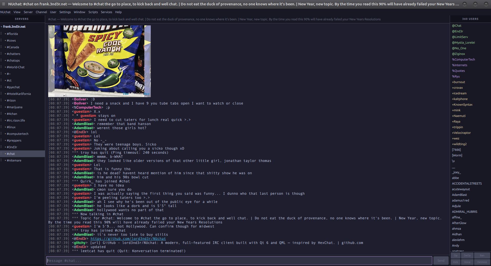

# NUchat

A modern, full-featured IRC client built with Qt 6 and QML — inspired by HexChat.


---

## Screenshot



---

## Features

- **Multi-server** — connect to multiple networks simultaneously
- **SSL/TLS** on all connections with **per-network SASL** (PLAIN/EXTERNAL) and **NickServ auto-identify**
- **25 built-in themes** — HexChat Dark, Monokai, Dracula, Nord, Gruvbox, Catppuccin, and more
- **mIRC color codes** — full rendering (foreground, background, bold, italic, underline, hex colors) and input shortcuts (`Ctrl+K` color, `Ctrl+B` bold, `Ctrl+U` underline, `Ctrl+I` italic, `Ctrl+O` reset)
- **Clickable URLs** with inline image previews
- **Nick list** with multi-select (Ctrl+click, Shift+click) and mode buttons (Op, DeOp, Ban, Kick, Voice, DeVoice)
- **Tab nick-completion** with cycling
- **Input history** — Up/Down arrow keys recall previous messages
- **Auto-focus input** — typing anywhere in the window goes to the input bar
- **Scrollback** — loads last 200 lines from logs when rejoining a channel
- **Channel logging** to `~/.config/NUchat/NUchat/logs/`
- **60+ command aliases** — see [docs/COMMANDS.md](docs/COMMANDS.md)
- **Services menus** — NickServ, ChanServ, OperServ, HostServ, MemoServ, BotServ
- **Right-click context menus** on nicks and links
- **10 pre-configured networks** (Libera.Chat, OFTC, EFnet, DALnet, Rizon, and more)
- **Per-network identity** override (nick, username, real name)
- **Channel modes on join** — displays mode string when entering a channel
- **Dynamic title bar** — shows channel, server, and topic (like HexChat)
- **C++ plugin system** and **Python scripting engine**
- **ZNC bouncer** support
- **Desktop integration** — `.desktop` file, SVG icon, `make install` support

---

## Quick Start

### Dependencies

**Ubuntu/Debian:**
```
sudo apt install build-essential cmake \
  qt6-base-dev qt6-declarative-dev qt6-quickcontrols2-dev \
  libgl1-mesa-dev
```

**Fedora:**
```
sudo dnf install cmake gcc-c++ \
  qt6-qtbase-devel qt6-qtdeclarative-devel qt6-qtquickcontrols2-devel \
  mesa-libGL-devel
```

**Arch:**
```
sudo pacman -S cmake qt6-base qt6-declarative qt6-quickcontrols2
```

### Build & Run

```bash
git clone https://github.com/lord3nd3r/NUchat.git
cd NUchat
mkdir build && cd build
cmake ..
make -j$(nproc)
./src/nuchat
```

### Install (optional)

```bash
sudo make install
```

Uses GNUInstallDirs — installs binary, desktop file, icon, and plugin/script directories. Uninstall with `sudo make uninstall`.

---

## Configuration

| Path | Purpose |
|------|---------|
| `~/.config/NUchat/NUchat.conf` | Settings (theme, window geometry, networks, identity) |
| `~/.config/NUchat/NUchat/logs/` | Channel logs (per-network, per-channel) |
| `~/.config/NUchat/scripts/` | Python scripts |
| `~/.cache/NUchat/images/` | Cached inline image previews |

---

## Themes

25 themes available via **Settings > Themes** or the Next/Previous Theme menu items:

HexChat Dark (default), Monokai, Solarized Dark/Light, Dracula, Nord, Gruvbox Dark/Light, One Dark/Light, Catppuccin Mocha/Latte, Tokyo Night, Material Dark, Cyberpunk, Retro Green, Retro Amber, Zenburn, Ayu Dark, GitHub Dark, Midnight Blue, Rose Pine, Everforest Dark, Ice, High Contrast

---

## Documentation

| Document | Contents |
|----------|----------|
| [Commands](docs/COMMANDS.md) | All 60+ IRC commands and aliases |
| [Menus & Dialogs](docs/MENUS.md) | Menu bar reference, right-click menus, and dialog descriptions |
| [Scripting API](docs/SCRIPTING.md) | Python and Lua scripting reference (HexChat-compatible) |
| [Plugin API](docs/PLUGINS.md) | C++ plugin interface and build instructions |

---

## Project Structure

```
NUchat/
├── src/                    C++ backend
│   ├── main.cpp            Entry point
│   ├── IrcConnection.*     IRC protocol (QSslSocket, CAP LS 302, SASL)
│   ├── IRCConnectionManager.*  Multi-server management, command dispatch
│   ├── MessageModel.*      Chat messages, IRC→HTML, image embeds, nick colors
│   ├── Logger.*            Channel logging
│   ├── Version.h           Single source of truth for version string
│   └── ...                 ThemeManager, Settings, ScriptManager, PluginManager
├── qml/                    QML UI
│   ├── main.qml            Main window (sidebar, chat, nick list, menus)
│   ├── ThemeManager.qml    25 built-in themes (50+ color properties each)
│   ├── NetworkListDialog.qml  Network manager with drag-and-drop reorder
│   └── ...                 14 dialog/component files
├── plugins/                C++ plugin directory
├── scripts/                Python scripts
├── resources/              Icons, .desktop file, theme JSON
├── tests/                  Unit tests
└── docs/                   Extended documentation
```

---

## Plugins & Scripts

### C++ Plugins

Implement `PluginInterface` (see `src/PluginInterface.h`), compile as a shared library, drop into `plugins/`. Example in `plugins/exampleplugin/`.

### Python Scripts

Place `.py` files in `~/.config/NUchat/scripts/`. Loaded automatically on startup. See `scripts/example.py`.

---

## TODO

### High Priority
- [ ] DCC file transfer (send/receive)
- [x] Ignore list (message filtering)
- [x] Auto-reconnect on disconnect
- [x] SASL handshake completion (PLAIN/EXTERNAL)
- [x] Per-network NickServ auto-identify
- [x] Perform-on-connect commands

### Features
- [x] Spell checking
- [x] Away log
- [x] URL Grabber
- [x] Configurable keyboard shortcuts
- [ ] Detach/attach tabs
- [x] Proxy support (SOCKS4/5, HTTP CONNECT)

### Packaging
- [ ] CI/CD pipeline (GitHub Actions)
- [ ] AppImage / Flatpak / .deb packaging
- [x] Plugin & scripting API documentation

---

## License

Licensed under the [GNU General Public License v3.0](LICENSE).
