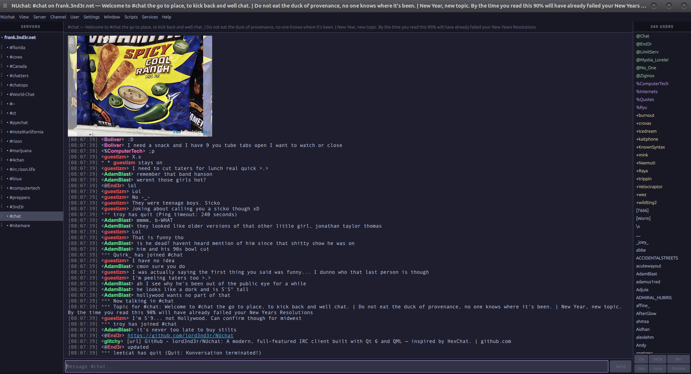

# NUchat

A modern, full-featured IRC client built with Qt 6 and QML — inspired by HexChat.


---

## Screenshot



---

## Features

- **Multi-server** — connect to multiple networks simultaneously
- **SSL/TLS** on all connections with **per-network SASL** (PLAIN/EXTERNAL) and **NickServ auto-identify**
- **25 built-in themes** — HexChat Dark, Monokai, Dracula, Nord, Gruvbox, Catppuccin, and more
- **mIRC color codes** — full rendering (foreground, background, bold, italic, underline, hex colors) and input shortcuts
- **Clickable URLs** with inline image previews
- **DCC file transfer** — send/receive files with progress, ETA, and speed metrics
- **Nick list** with multi-select (Ctrl+click, Shift+click) and mode buttons (Op, DeOp, Ban, Kick, Voice, DeVoice)
- **Tab nick-completion** with cycling
- **Input history** — Up/Down arrow keys recall previous messages
- **Paste flood protection** — confirmation dialog when pasting multiple lines
- **Spell checker** — integrated Hunspell support with squiggly underlines and right-click suggestions
- **Auto-focus input** — typing anywhere in the window goes to the input bar
- **Smart chat area** — auto-scroll, jump-to-bottom button, and "new messages" marker line
- **Collapsible event groups** — groups multiple joins/parts/quits into a single clickable summary line
- **Lag meter** — visual PING/PONG RTT indicator in the status bar
- **Scrollback** — loads last 200 lines from logs when rejoining a channel
- **Channel logging** to `~/.config/NUchat/NUchat/logs/`
- **60+ command aliases** — see [docs/COMMANDS.md](docs/COMMANDS.md)
- **Services menus** — NickServ, ChanServ, OperServ, HostServ, MemoServ, BotServ
- **Right-click context menus** on nicks and links
- **10 pre-configured networks** (Libera.Chat, OFTC, EFnet, DALnet, Rizon, and more)
- **Per-network identity** override (nick, username, real name)
- **Channel modes on join** — displays mode string when entering a channel
- **Dynamic title bar** — shows channel, server, and topic (like HexChat)
- **C++ plugin system**, **Python scripting engine**, and **Lua scripting engine** — HexChat-compatible API
- **Migrate from HexChat** — first-launch wizard imports your scripts, server list, and identity
- **ZNC bouncer** support
- **Proxy support** — SOCKS4/5 and HTTP CONNECT
- **Desktop integration** — `.desktop` file, SVG icon, system tray, notifications, `make install` support

---

## Quick Start

### Dependencies

**Ubuntu/Debian:**
```
sudo apt install build-essential cmake \
  qt6-base-dev qt6-declarative-dev qt6-quickcontrols2-dev \
  libgl1-mesa-dev
```

**Fedora:**
```
sudo dnf install cmake gcc-c++ \
  qt6-qtbase-devel qt6-qtdeclarative-devel qt6-qtquickcontrols2-devel \
  mesa-libGL-devel
```

**Arch:**
```
sudo pacman -S cmake qt6-base qt6-declarative qt6-quickcontrols2
```

### Build & Run

```bash
git clone https://github.com/lord3nd3r/NUchat.git
cd NUchat
mkdir build && cd build
cmake ..
make -j$(nproc)
./src/nuchat
```

### Install (optional)

```bash
sudo make install
```

Uses GNUInstallDirs — installs binary, desktop file, icon, and plugin/script directories. Uninstall with `sudo make uninstall`.

---

## Configuration

| Path | Purpose |
|------|---------|
| `~/.config/NUchat/NUchat.conf` | Settings (theme, window geometry, networks, identity) |
| `~/.config/NUchat/NUchat/logs/` | Channel logs (per-network, per-channel) |
| `~/.config/NUchat/scripts/` | Python scripts |
| `~/.cache/NUchat/images/` | Cached inline image previews |

### Self-signed / untrusted SSL certificates

If your IRC server uses a self-signed certificate or one where the hostname doesn't match (common on self-hosted servers), you'll see an SSL error and the connection will be refused. To allow it:

1. Open **Settings → Preferences → Connection**
2. Check **"Accept self-signed / untrusted SSL certificates"**
3. Reconnect

This covers hostname mismatches, self-signed certs, and untrusted issuer chains. It does **not** suppress errors for expired certificates or other hard failures.

## Downloads

Pre-built installers and binaries are available for Windows, macOS, and Linux:

- **Windows**: Download NSIS installer from [GitHub Actions artifacts](https://github.com/lord3nd3r/NUchat/actions/workflows/build.yml) (select latest successful run → Artifacts → Windows-Installer)
- **macOS**: Download `.dmg` installer from [GitHub Actions artifacts](https://github.com/lord3nd3r/NUchat/actions/workflows/build-macos.yml) (select latest successful run)
- **Linux/FreeBSD**: Compile from source (see Build & Run section below) or download from [GitHub Actions artifacts](https://github.com/lord3nd3r/NUchat/actions)

---

## Windows Build (for developers)

If you prefer to build locally on Windows:

**Local build steps (recommended for testing):**

1. Install **Visual Studio 2022** with the "Desktop development with C++" workload.
2. Download and install **Qt 6.8.x** for **MSVC 2022 64-bit** from [qt.io](https://www.qt.io/download-open-source) (open source version is fine).
3. Add the Qt bin directory to your PATH (e.g. `C:\Qt\6.8.3\msvc2022_64\bin`).
4. Open **Developer Command Prompt for VS 2022**.
5. In the project directory:
   ```cmd
   mkdir build && cd build
   cmake .. -A x64
   cmake --build . --config Release
   ```
6. The executable is `build\src\Release\nuchat.exe`.

To bundle the Qt DLLs, run `windeployqt --qmldir ..\qml --no-translations build\src\Release\nuchat.exe`.

**Note:** Python scripting is currently disabled on Windows builds (due to embedding complexities). Lua and C++ plugins work fine. HexChat migration also works.

See `CMakeLists.txt` and `src/CMakeLists.txt` for the cross-platform setup. PRs welcome for improvements.


## Migrating from HexChat

If HexChat data is detected in `~/.config/hexchat/` on first launch, NUchat will offer to import:

| What | Source |
|------|--------|
| Python & Lua scripts | `~/.config/hexchat/addons/*.py` / `*.lua` |
| Server/network list | `~/.config/hexchat/servlist.conf` |
| Nick, username, realname | `~/.config/hexchat/hexchat.conf` |

You can also run the wizard later via **Settings → Preferences → Scripts → Open Migration Wizard**.

Existing scripts and networks in NUchat are never overwritten.

---

## Themes

25 themes available via **Settings > Themes** or the Next/Previous Theme menu items:

HexChat Dark (default), Monokai, Solarized Dark/Light, Dracula, Nord, Gruvbox Dark/Light, One Dark/Light, Catppuccin Mocha/Latte, Tokyo Night, Material Dark, Cyberpunk, Retro Green, Retro Amber, Zenburn, Ayu Dark, GitHub Dark, Midnight Blue, Rose Pine, Everforest Dark, Ice, High Contrast

---

## Documentation

| Document | Contents |
|----------|----------|
| [Commands](docs/COMMANDS.md) | All 60+ IRC commands and aliases |
| [Menus & Dialogs](docs/MENUS.md) | Menu bar reference, right-click menus, and dialog descriptions |
| [Scripting API](docs/SCRIPTING.md) | Python and Lua scripting reference (HexChat-compatible) |
| [Plugin API](docs/PLUGINS.md) | C++ plugin interface and build instructions |

---

## Project Structure

```
NUchat/
├── src/                    C++ backend
│   ├── main.cpp            Entry point
│   ├── IrcConnection.*     IRC protocol (QSslSocket, CAP LS 302, SASL)
│   ├── IRCConnectionManager.*  Multi-server management, command dispatch
│   ├── MessageModel.*      Chat messages, IRC→HTML, image embeds, nick colors
│   ├── Logger.*            Channel logging
│   ├── Version.h           Single source of truth for version string
│   └── ...                 ThemeManager, Settings, ScriptManager, PluginManager
├── qml/                    QML UI
│   ├── main.qml            Main window (sidebar, chat, nick list, menus)
│   ├── ThemeManager.qml    25 built-in themes (50+ color properties each)
│   ├── NetworkListDialog.qml  Network manager with drag-and-drop reorder
│   └── ...                 14 dialog/component files
├── plugins/                C++ plugin directory
├── scripts/                Python scripts
├── resources/              Icons, .desktop file, theme JSON
├── tests/                  Unit tests
└── docs/                   Extended documentation
```

---

## Plugins & Scripts

### C++ Plugins

Implement `PluginInterface` (see `src/PluginInterface.h`), compile as a shared library, drop into `plugins/`. Example in `plugins/exampleplugin/`.

### Python Scripts

Place `.py` files in `~/.config/NUchat/scripts/`. Loaded automatically on startup. See `scripts/example.py`.

---

## TODO

### Planned Features
- **`echo-message` CAP** — Server echoes your messages back with proper timestamp
- **`account-notify` / `extended-join`** — Show account info in join messages
- **Channel LIST improvements** — User count, topic, min/max filter
- **Per-network auto-join list** — Explicit auto-join channels in Network List dialog
- **Log rotation** — Configurable per-channel logging enable/disable
- **SASL SCRAM-SHA-256** — Modern SASL mechanism
- **Detach/attach tabs** — Float channel tabs into separate windows
- **AppImage / Flatpak / .deb packaging**

See `TODO.md` for the full roadmap.

---

## License

Licensed under the [GNU General Public License v3.0](LICENSE).
